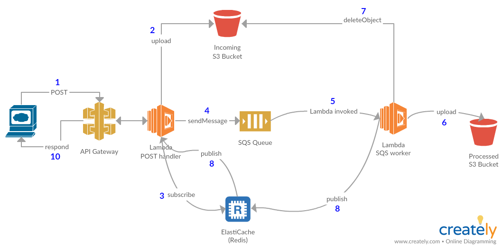

# Serverless batch processing

For this experiment I wanted a solution for scalable batch processing using all AWS managed components.

Additionally, I wanted the response to the HTTP requester to be blocked until the processing was finished, so it could be sure the processing succeeded and not have to turn around and poll us to be sure. This is a requirement of the clients I'm working with.

I didn't want my lambda POST handle to have to poll S3 for the expected final product (although in hindsight that would be a much simpler solution), so I used Elasticache for Redis' [pubsub features](https://redis.io/topics/pubsub) to notify it that the backend lambda's work was done. This however required configuring the lambda functions to [be able to access resources in my VPC](https://docs.aws.amazon.com/lambda/latest/dg/vpc.html), which it can't normally do, and this comes with some special requirements:

* You tell lambda what subnet ids to run in, and then it creates ENIs on demand in one of those subnets.
* So you need enough free IPs, potentially up to a 1000 (the current lambda max simultaneous execution limit)
* Lambdas no longer have Internet access (which includes any AWS managed service like SQS), so you have to put them in a private subnet with default routing through a NAT Gateway. (I did look into VPC endpoints, and that could be another solution, e.g. for S3, but seems like SQS is not supported, so you still need a NAT gateway).

Currently Lambda functions can't natively feed off or be triggered by SQS, but I stumbled across [a clever way]((http://theburningmonk.com/2016/04/aws-lambda-use-recursive-function-to-process-sqs-messages-part-1/)) to spawn an infinite chain of lambda executions. He refers to it as recursive lambda functions, but I think of it more as perpetual self-reexecution, because they don't stack up: just before exiting, you launch another execution. Each execution long-polls off SQS, up to the max wait time of 20 seconds. He has some math on the costs, and it's dirt cheap, even to run full time.

The next hurdle would be scaling, and the same guy has an article on [scaling this solution automatically](https://medium.com/theburningmonk-com/aws-lambda-use-recursive-function-to-process-sqs-messages-part-2-28b488993d8e). Really cool, I hope to try it out soon.

